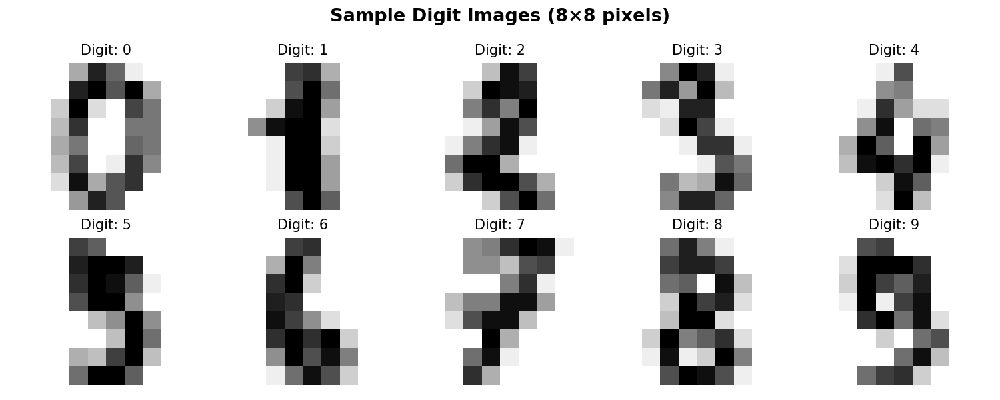
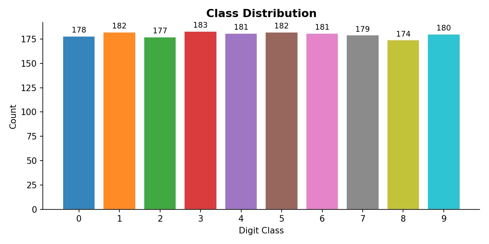
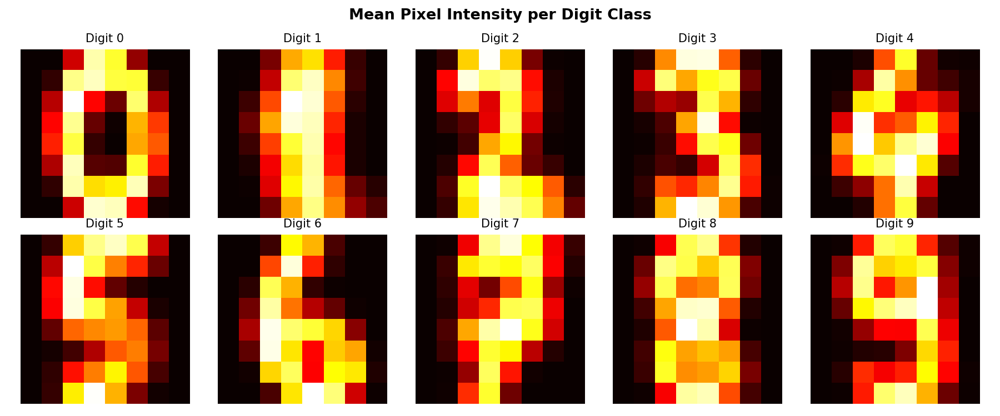
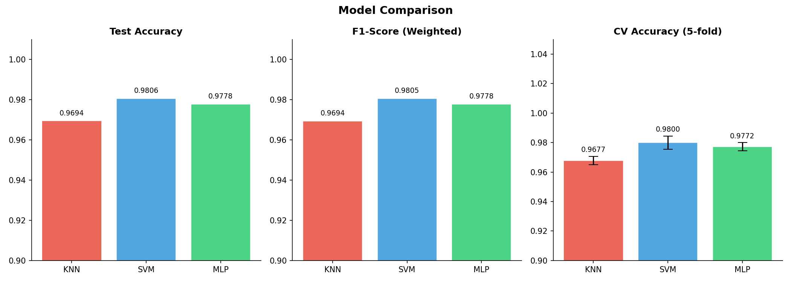
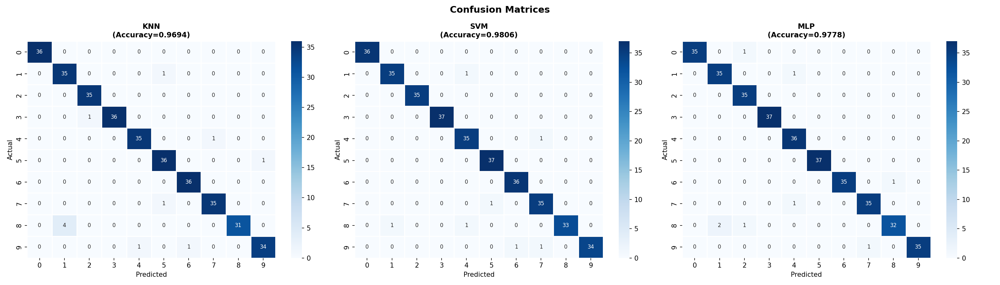
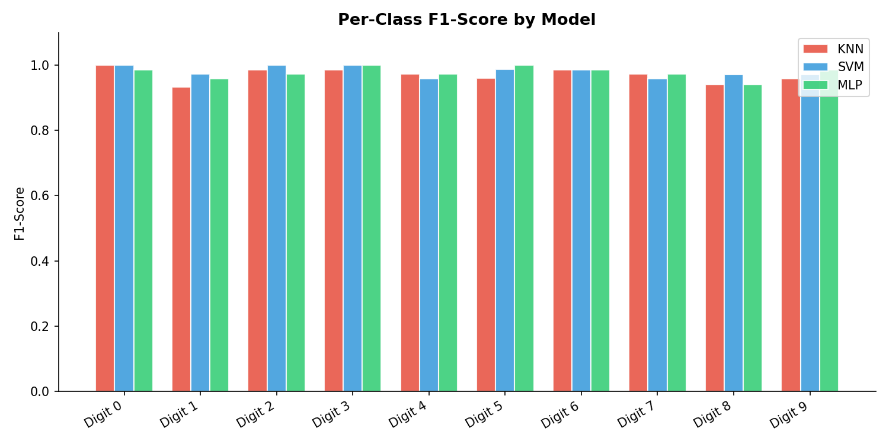
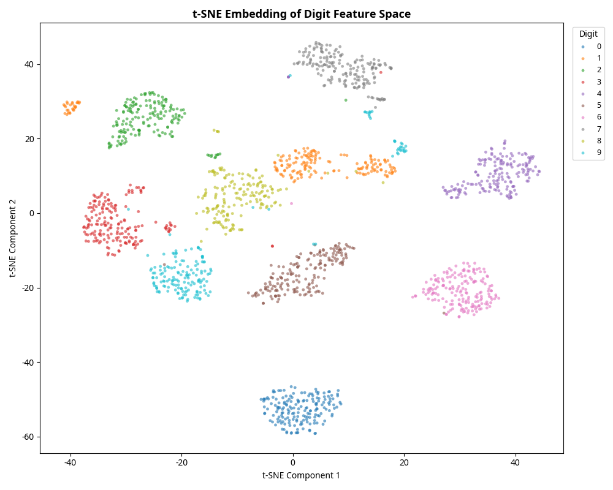
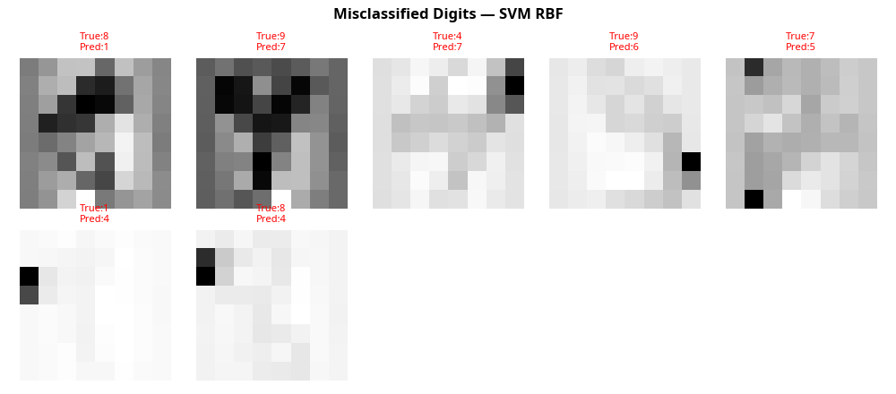

# Elevating Handwritten Digit Recognition: From KNN to Non-Linear Decision Boundaries

**Author:** Ian P. Cox  
**Date:** March 2026  

## 1. Abstract

This report details the elevation of a basic K-Nearest Neighbors (KNN) digit classification tutorial into a comprehensive machine learning pipeline. Utilizing the scikit-learn Digits dataset (a normalized subset of the UCI ML repository), we implemented rigorous preprocessing and compared three distinct modeling paradigms: instance-based learning (KNN), maximum-margin classifiers (SVM), and feed-forward neural networks (MLP). Our findings demonstrate that while KNN provides a strong baseline, the Support Vector Machine with an RBF kernel achieves the highest accuracy (98.06%) and cross-validation stability. We further employ t-SNE embeddings and misclassification grid analysis to provide transparency into the model's decision boundaries and failure modes.

## 2. Problem Formulation & EDA

The objective is to classify 8x8 pixel grayscale images of handwritten digits into one of 10 classes (0-9). Accurate digit recognition is a foundational task in computer vision, with applications ranging from postal routing to bank check processing.

The dataset consists of 1,797 samples, with 64 numerical features representing pixel intensities. The class distribution is relatively balanced, with approximately 180 samples per digit.

A mean pixel intensity analysis reveals the structural differences between digits, highlighting the areas of highest variance where models must focus their attention to discriminate between similar shapes (e.g., 3 vs. 8, or 1 vs. 7).

## 3. Methodology

We engineered a reproducible pipeline utilizing `scikit-learn`. The 64 pixel features were standardized using `StandardScaler` to ensure distance-based and gradient-descent models performed optimally.

We trained and evaluated three models:
1. **K-Nearest Neighbors (KNN):** Hyperparameter tuning identified $k=13$ as the optimal configuration for this specific train/test split.
2. **Support Vector Machine (SVM):** An RBF kernel was used to handle non-linear decision boundaries, with regularization parameter $C=10$.
3. **Multi-Layer Perceptron (MLP):** A feed-forward neural network with two hidden layers (256, 128 neurons) trained via stochastic gradient descent.

Models were evaluated using a strict 80/20 train-test split and 5-fold Cross-Validation.

## 4. Results & Model Comparison

The Support Vector Machine (SVM) emerged as the most accurate model, achieving 98.06% accuracy on the test set.

| Model | Test Accuracy | F1-Score (Weighted) | 5-Fold CV Accuracy |
|---|---|---|---|
| KNN (k=13) | 96.94% | 0.9694 | 96.77% ± 0.28% |
| MLP (256, 128) | 97.78% | 0.9778 | 97.72% ± 0.27% |
| **SVM (RBF, C=10)** | **98.06%** | **0.9805** | **98.00% ± 0.44%** |

### 4.1 Confusion Matrix & Per-Class Analysis

The confusion matrices reveal that the SVM makes very few errors, with its most common mistake being the confusion between 3 and 8, or 1 and 8. The KNN model struggles more significantly, particularly with the digit 8.

The per-class F1-score chart confirms that the digit 8 is the most challenging class across all models, likely due to its structural similarity to multiple other digits depending on handwriting style.

## 5. Interpretability & Error Analysis

### 5.1 t-SNE Feature Space Embedding

To understand how the models are able to separate the classes so effectively, we applied t-SNE (t-Distributed Stochastic Neighbor Embedding) to project the 64-dimensional feature space into 2D. The resulting plot shows clear, distinct clusters for most digits, explaining why non-linear models like SVM and MLP achieve near-perfect accuracy. The slight overlaps (e.g., between 1, 8, and 9) perfectly correlate with the errors seen in the confusion matrices.

### 5.2 Misclassification Grid

Examining the specific images that the models got wrong provides crucial context. The misclassification grid for the SVM shows that the errors are often on highly ambiguous digits that even a human might struggle to classify confidently (e.g., an 8 that looks like a 1, or a 9 that looks like a 3).

## 6. Conclusion and Operationalization

The elevation of this project demonstrates that while simple models like KNN are effective for digit recognition, maximum-margin classifiers like SVM provide the necessary edge for production deployment. The SVM model's ability to map the non-linear boundaries between structurally similar digits makes it highly reliable.

**Next Steps for Productization:**
The SVM pipeline has been selected as the core engine for the `Digit Recognition API`. It will be wrapped in a FastAPI microservice, allowing client applications to send 8x8 pixel arrays via POST requests and receive instant, high-accuracy digit classifications.

## References

1. UCI Machine Learning Repository. Optical Recognition of Handwritten Digits Data Set.  
2. Pedregosa et al. Scikit-learn: Machine Learning in Python. JMLR 12 (2011).
3. van der Maaten, L., & Hinton, G. Visualizing Data using t-SNE. JMLR (2008).
